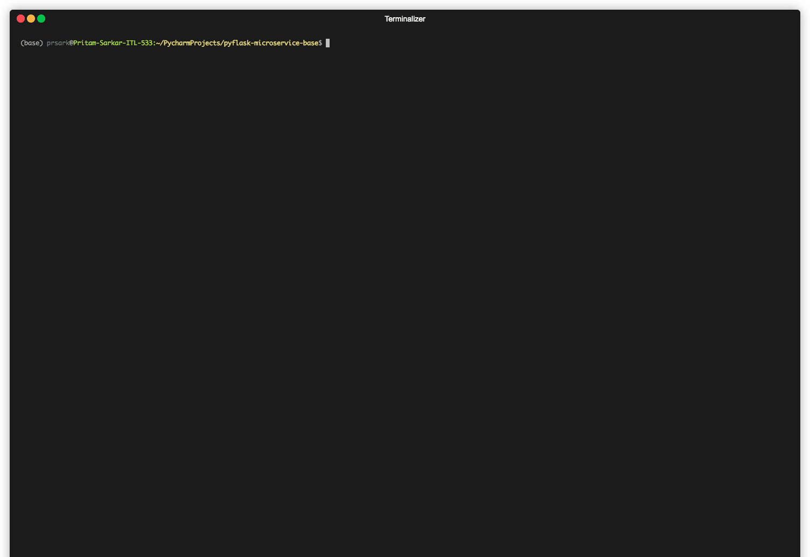
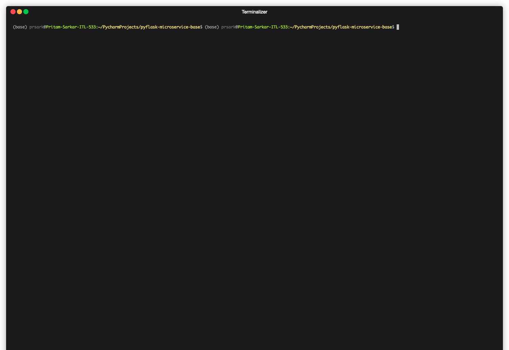

pyflask-microservice-base
------------------------------------------------------------------------------
An "optionally opinionated and structured" flask boilerplate microservice for jump-starting development

Tools
------------------------------------------------------------------------------

Usage Guide
------------------------------------------------------------------------------
This is a template project hosted on GitHub which can be used to create new repositories.

Steps for creating boilerplate project in GitHub
------------------------------------------------------------------------------
0. Create a new repository named "my-pyflask-project" using this template repository *
0. `git clone https://www.github.com/username/my-pyflask-project.git`
0. `cd my-pyflask-project`
0. Create and activate conda environment `conda activate my-conda-venv` **
0. `make setup` : Use pip-tools, pip-compile, pip install to setup python packages

\* [GitHub Guide: Creating a repository from a template](https://docs.github.com/en/github/creating-cloning-and-archiving-repositories/creating-a-repository-from-a-template)
 
\** [Guide to Conda environment](https://github.com/pritam001/pyflask-microservice-base/blob/master/documentation/conda.md)

Make Guide
------------------------------------------------------------------------------
Type `make help` for available commands

Linting Guide
------------------------------------------------------------------------------
`make format` : Format and fix python code with black, isort, autoflake

`make lint` : Run static analysis with flake8, radon, mypy and bandit

